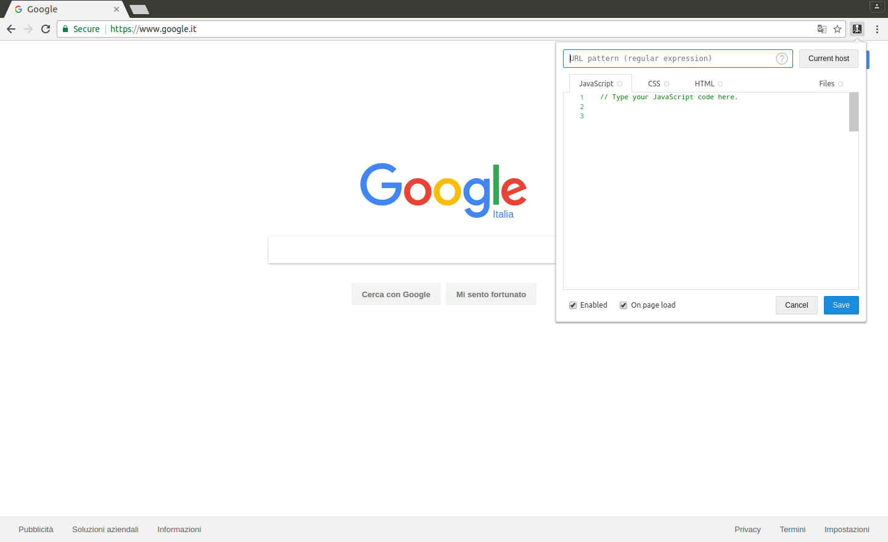
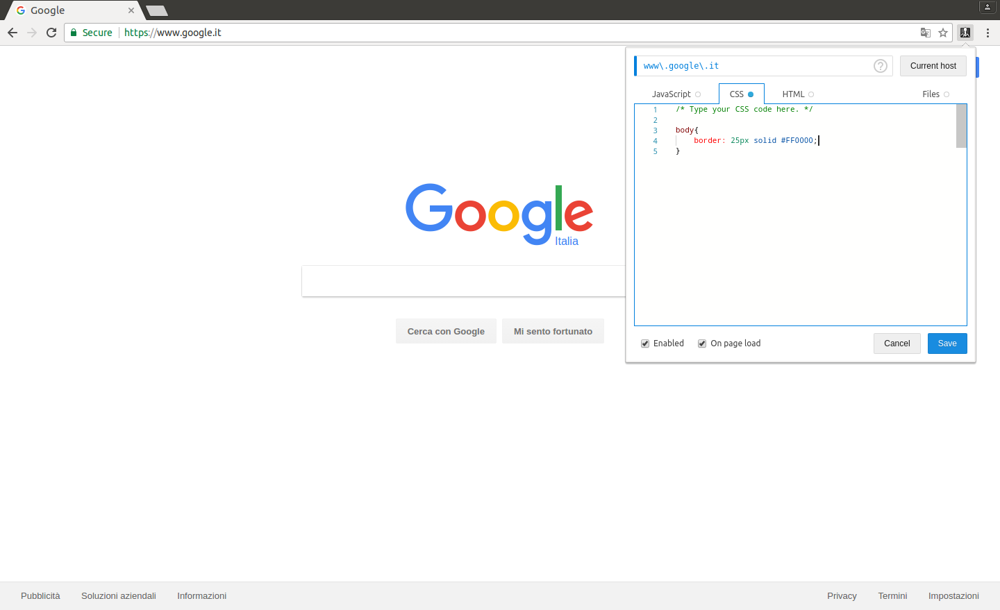
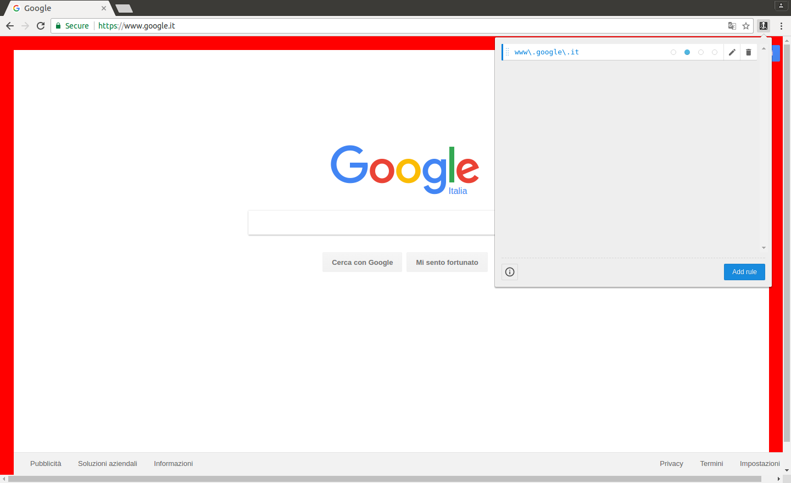
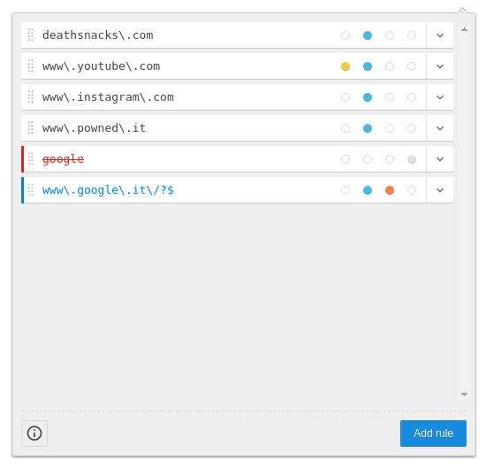
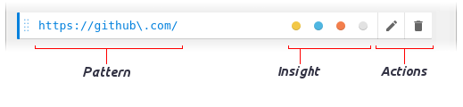
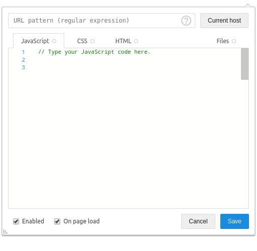
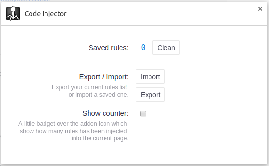
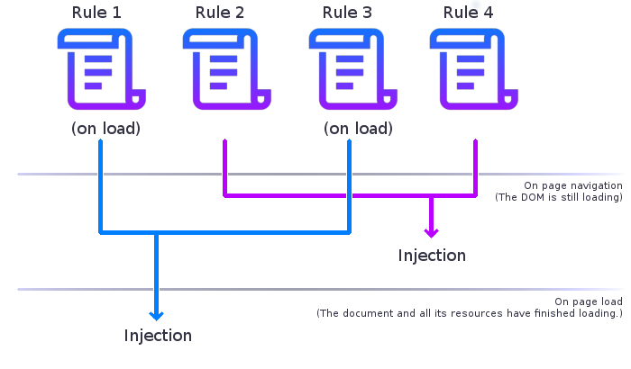

# Code-Injector
A [WebExtensions](https://developer.mozilla.org/en-US/Add-ons/WebExtensions) based addon which let the user inject code into the websites

> This is an add-on which requires a minimum of knowledge of web programming to be able to properly use it.  

### Purpose

There are several sites with invasive popups / login screens, a messy layout or some missing capabilities.  
I was usually getting around these boring stuff by opening the browser console to edit the DOM style and structure but it was starting to get tiring doing it everytime, so why not making and extension which do it by itself in background?

### Contents

* [Quick start](https://github.com/Lor-Saba/Code-Injector#quick-start)
* [Main view](https://github.com/Lor-Saba/Code-Injector#main-view-rules-list)
  * [Rules](https://github.com/Lor-Saba/Code-Injector#rules)
  * [Rules structure](https://github.com/Lor-Saba/Code-Injector#rules-structure)
* [Editor view](https://github.com/Lor-Saba/Code-Injector#editor-view)
  * [URL Pattern](https://github.com/Lor-Saba/Code-Injector#url-pattern)
  * [Editors](https://github.com/Lor-Saba/Code-Injector#editors)
  * [Files](https://github.com/Lor-Saba/Code-Injector#files)
  * [Enabled](https://github.com/Lor-Saba/Code-Injector#enabled)
  * [On page load](https://github.com/Lor-Saba/Code-Injector#on-page-load)
* [Options view](https://github.com/Lor-Saba/Code-Injector#options-view)
  * [Saved rules](https://github.com/Lor-Saba/Code-Injector#saved-rules)
  * [Size](https://github.com/Lor-Saba/Code-Injector#size)
  * [Import / Export](https://github.com/Lor-Saba/Code-Injector#import--export)
  * [Show counter](https://github.com/Lor-Saba/Code-Injector#show-counter)
* [Injection flow](https://github.com/Lor-Saba/Code-Injector#injection-flow)
* [Installation](https://github.com/Lor-Saba/Code-Injector#installation)
* [What's next](https://github.com/Lor-Saba/Code-Injector#whats-next)
* [Changelog](https://github.com/Lor-Saba/Code-Injector#changelog)
  * [1.0.0](https://github.com/Lor-Saba/Code-Injector#100--------)
* [Credits](https://github.com/Lor-Saba/Code-Injector#credits)
* [Info](https://github.com/Lor-Saba/Code-Injector#info)


## Quick start

Get started creating a new *[Rule](https://github.com/Lor-Saba/Code-Injector#rules)*.  
[](https://raw.githubusercontent.com/Lor-Saba/Code-Injector/master/readme-resources/screenshots/1.png)
[](https://raw.githubusercontent.com/Lor-Saba/Code-Injector/master/readme-resources/screenshots/2.png)

Complete the *Rule* by entering the [*URL Pattern* and *Contents*](https://github.com/Lor-Saba/Code-Injector#editor-view), then save and reload the page (or navigate to the matching address) to apply your script.  
[](https://raw.githubusercontent.com/Lor-Saba/Code-Injector/master/readme-resources/screenshots/3.png)
[](https://raw.githubusercontent.com/Lor-Saba/Code-Injector/master/readme-resources/screenshots/4.png)

--------------

## Main view (Rules list)


The *Main view* is the initial and main page of the addon where you can create and manage your code injections with a list of *Rules*.

#### Rules

A *Rule* may contain **JavaScript**, **CSS**, **HTML** and **Files** and will be splitted and injected with the following order:  

 1. Files (from top to bottom) 
 2. CSS
 3. HTML
 4. JavaScript

>**Note:**  
>Each rule will inherit the previous injected code. 

#### Rules structure


The *Rule*'s element bar can be subdivided into 3 sections:  *Pattern*, *Insight* and *Actions*.

- **Pattern:**  
  The Rule's *Pattern*, as defined [here](https://github.com/Lor-Saba/Code-Injector#url-pattern) in the *Editor section*, specifies in what pages the rule should be applied.    
  It will be highlighted in blue if it matches with the address of the current page.   
  If the rule is disabled the *Patern* is highlighted in red with a line over the text.  
  Also, the whole area is draggable allowing to move the *Rule* and change the injection order.

- **Insight:**  
  Shows a minimal description of the Rule whether contains or not a language using 4 coloured dots.  
  (from left to right: *JavaScript*, *CSS*, *HTML* and *Files*)

- **Actions:** 
  - **Edit**  
  Open the Rule in the *Editor view*.  

  - **Delete**   
    Delete the Rule. Must be clicked twice, the button will extend as if asking for the user confimation. 


## Editor view


The *Editor view* is the page where can be defined a [*Rule*](https://github.com/Lor-Saba/Code-Injector#rules) codes and properties. 

#### URL pattern

The URL pattern specifies in what pages the rule should be applied.  

When a page is opened, the pattern will be matched against the full address of the new page, if the pattern corresponds with that address then the code contained in the rule will be injected into the page.  

The URL pattern follows the ECMAScript (a.k.a. JavaScript) regular expressions syntax, see [here](https://developer.mozilla.org/en-US/docs/Web/JavaScript/Guide/Regular_Expressions) for more detailed information.  

The add-on helps you on checking whether the pattern is correct by highlighting it in blue if it matches with the address of the current page and highlight it in red if it is invalid.  

In depth example in case of *google* as url pattern:  
*<small style="color: #555">(this example is just for knowledge purposes)</small>*  

```javascript
    // the URL pattern "google" is passed as argument 
    // by the "URL Pattern" to the RegExp constructor.
    new RegExp("google");

    // resulting in..
    /google/

    // assuming "https://www.google.com" as page address:
    /google/.test("https://www.google.com");

    // if TRUE the rule will be queued for injection

```  

> **Note:**  
> Because the URL pattern text box is meant to contain only a regular expression, the forward slashes / used as delimiters in the JavaScript language are not needed.  
*You should therefore write `hello world` instead of `/hello world/`*.

#### Editors

The main section of the *Editor view*.  

From left to right you can access the *JavaScript*, *CSS*, *HTML* editors and the *Files* manager by clicking on the tabs.  

>**Note:**  
>If an editor contains just comments the code wont be injected. 


#### Files

In the *Files* tab you can manage the injection of __local*__ or __remote__ files.  

While typing the file path, an icon should appear on the right side of the input area indicating whether the file is remote or local and it's type (js/css/html) in blue.  
If the file extension is not recognized as one of the 3 types mentioned above then the icon will show a red "X" on the edge and the file will be skipped from injection.  

>**Note:**  
>The file type can forced by clicking on the icon and selecting the supposed language from the dropdown menu.

>**IMPORTANT:**  
>The injection of *local* files is experimental and could stop working anytime with browser's updates.

#### Enabled:

If `TRUE`, define if the current rule can be injected.

#### On page load:

If `TRUE`, the rule will be injected on page load, else it will be injected on navigation.  
Check the [Injection flow](https://github.com/Lor-Saba/Code-Injector#injection-flow) for more details.


## Options view


#### Saved rules

A simple section wich shows the number of total registered rules and a button to remove them all.

> **Note:**  
> The *Clean* button must be clicked twice to confirm the action.

#### Size

Define the size of the popup window. (in px)

#### Import / Export

- To export press on the `export` button.  
  The *Rules* will be exported as a browser download.
- To import press on the `import` button.  
  Navigate into your system and select a file containing a valid *JSON* of *Rules*.   

*A message should appear to tell whether the operation is successful or not.* 

#### Show counter

If `true`, a badge with the number of currently injected rules will be visible over the icon.  


## Injection flow

A *Rule* by default is set up to be injected on page load *(after the document and all its resources have finished loading)* but can be changed to be injected when the navigation is committed *(the DOM is recived and still loading)* by deselecting the property "[On page load](https://github.com/Lor-Saba/Code-Injector#on-page-load)" in the *Editor view*.

The rules whose *URL Pattern* match with the page address will be selected and queued for injection. (from top to bottom, grouped by type) 




## Installation

You can find and install this extension from the browsers store pages:

[]()
[]()
[]()

 

otherwise you can download, build and install the repository manually.  

- download the repository,
- launch `npm install` to download the dev-dependencies,
- launch `grunt` to build the extension,
- a *dist* folder should have been generated containing the local version of Code-injector,
- load that folder into your browser:  

  - **Firefox:**  
  go to `about:debugging` and load it as temporary extension

  - **Chrome:**  
  Options > More tools > Extensions > Load unpacked extension...  

  - **Opera:**  
  Extensions > Developer mode > Load unpacked extension...  

  - **Edge:**  
  canceled  

  - **Safari:**  
  canceled


## What's next 

I would like to make it more and more easy to use so that even who's new to programming can use this add-on with ease.

## Changelog

### **[1.0.0]()**  <small><small>( ?? / ?? / ???? )</small></small>
* Initial release of Code-Injector.

## Credits

- Code editors handled using [monaco-editor](https://github.com/Microsoft/monaco-editor).
- WebExtensions API normalized using [webextension-polyfill](https://github.com/mozilla/webextension-polyfill).
- Buttons icons by [material-design-icons](https://github.com/google/material-design-icons).
- A thank you to [@JD342](https://github.com/JD342) for the help provided in the testing process and for the [Icon](https://github.com/JD342/code-injector-icons)!

## Info

*Code Injector* is written and maintained by [L.Sabatelli](https://github.com/Lor-Saba)  
Licenze: [GPLv3](https://www.gnu.org/licenses/quick-guide-gplv3.html)
